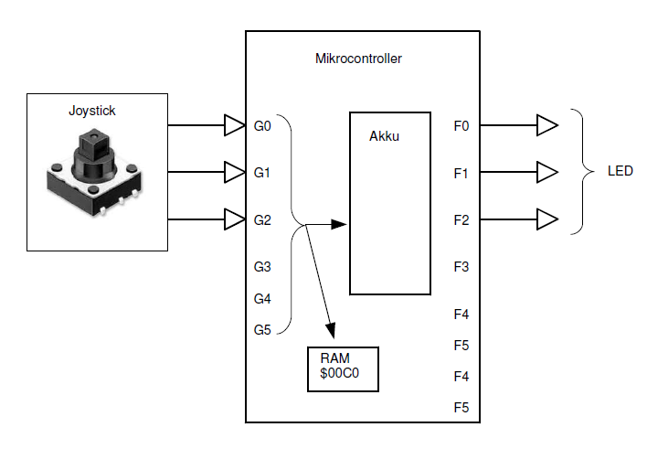

# MC-Car Aufgabe 2

**Am Port G liege durch den Joystick 3-bit Wert an. Dieser Wert ist direkt auf Port G und in das interne RAM auf Adresse `$00C0` zu kopieren. Jede Änderung des 3-bit Wertes soll nachgeführt werden. Füllen Sie anschliessend die Wahrheitstabelle aus.**



## Wahrheitstabelle

|   G2  |   G1  |   G0  | G2-0<br>Dezimal | Joystick<br>Position | LEDs (red / blue) |
|:-----:|:-----:|:-----:|:---------------:|----------------------|-------------------|
|   1   |   1   |   1   |        7        | Neutral              | -                 |
|   1   |   1   |   0   |        6        | Down                 | FL(b)             |
|   1   |   0   |   1   |        5        | Left                 | FL(r)             |
|   1   |   0   |   0   |        4        | Up                   | FL(r,b)           |
|   0   |   1   |   1   |        3        | Right                | FR(r)             |
|   0   |   1   |   0   |        2        | Press                | FR(r) & FL(b)     |
|   0   |   0   |   1   |        1        | -                    | FR(r) & FL(r)     |
|   0   |   0   |   0   |        0        | -                    | FR(r) & FL(r,b)   |

## 1. Assembler-Lösung
**1.1 Assembler-Lösung mit den symbolischen Namen der internen Steuerregister.**

```assembly
userMain:   LDA     #$FF
            STA     PTGPE       ; PTGPE (Port G Pull-Up Enable)
            STA     PTFDD       ; PTFDD = Output
Loop:       LDA     PTGD        ; Einlesen Joystick (PTGD)
            STA     PTFD        ; Ausgabe LED (PTFD)
            BRA Loop            ; Endlosschleife
```

**1.2  Assembler-Lösung mit den absoluten Adressen der internen Steuerregister.**

```assembly
userMain:   LDA     #$FF
            STA     $00001858   ; PTGPE
            STA     $0000000B   ; PTFDD
Loop:       LDA     $0000000C   ; PTGD
            STA     $0000000A   ; PTFD
            BRA     Loop        ; 
```

## 2. C-Lösung

```c
#include "platform.h" /* include peripheral declarations */

/**
 * main program
 */  
void main(void) 
{
    EnableInterrupts;       // Interrupts aktivieren
    PTGPE = 0x07;           // Joystick (Input)
    PTFDD = 0x07;           // LEDs (Output)
    
    PTCDD = 0x04;
    PTCD  = 0x04;           // Unterbodenbeleuchtung einschalten

    for(;;) 
    {   
    	PTFD = PTGD;        // Wert ausgeben

      __RESET_WATCHDOG(); /* feeds the dog */
    }
    
  /* please make sure that you never leave main */
}
```     
